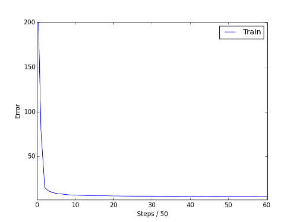

# Running the CIFAR-10 analysis experiments

# Contents
+ [Introduction](#introduction)
  + [Folder contents](#folder-contents)
+ [Running experiments](#running-experiments)
  + [Unsupervised training](#unsupervised-training)
  + [Supervised training](#supervised-training)

# Introduction

This folder contains the code used to obtain our results on the [CIFAR-10][CIFAR-10] dataset. This involves training a convolutional autoencoder (cae), and then training convolutional neural network (cnn) with four unsupervised to supervised training data ratios:

+ 50:1
+ 10:1
+ 5:1
+ 1:1

> :pushpin: **Note:** the amount of training images in CIFAR-10 is 50,000. We create our unsupservised to supervised ratio by keeping the number of unsupervised training samples fixed to 50,000, and shrinking our number of supervised samples uniformly across classes.

And with three types of regularization which are denoted as follows:

+ a = Data Augmentation
+ d = Dropout
+ u = Unsupervised Pre-training (with cae)

We will first describe the contents of this folder, and then walk you through
how to run the experiments.

## Folder contents
The folder contains:
``` shell
/cae
/50_to_1
/10_to_1
/5_to_1
/1_to_1
checkpoint_checker.py
checkpoints.py
models.py
```

The cae folder contains:
``` shell
/layer1/train.py
/layer2/train.py
/layer3/train.py
```

The other folders correspond to the ratios described above. Each folder contains:
``` shell
/cnn/train.py
/cnn_a/train.py
/cnn_d/train.py
/cnn_u/train.py
/cnn_ad/train.py
/cnn_au/train.py
/cnn_du/train.py
/cnn_adu/train.py
```

The folder name describes which regularization techniques are used, based on the legend above.

#### `train.py`
As you can see, there are several `train.py` files. Each one trains either a cae model (with 1, 2, or 3 layers), or a cnn model with various unsupervised to supervised data ratios and regularization methods turned on. Basically the `train.py` files do all the heavy lifting of running the individual experiments. They output a directory of model checkpoint files, and a log of the training process.

#### `checkpoint_checker.py`
The file `checkpoint_checker.py` is a script used to examine all the checkpoints created by a single experiment, and choose the best one.

#### `checkpoints.py`
Some of the experiments involve loading in pre-trained model checkpoints. The paths to those checkpoints will be inserted in `checkpoints.py`. The `train.py`
files will use these paths to load the checkpoints, and take care of the rest.

#### `models.py`
There are 4 neural network models used in these experiments. They include a 1, 2, and 3 layer cae, and a cnn with 3 convolutional layers. The code to construct these models is in `models.py`. They are used by the `train.py` files.

Next we will walk you through running the experiments.

# Running experiments
The experiments involve 1) training an unsupervised model, a stacked convolutional auto encoder as described in the paper, and 2) training supervised convolutional neural networks, with various regularization techniques.

We will first describe how to train the unsupervised model, and then how to run the supervised experiments.

## Unsupervised training

We train the cae in a greedy fashion. First we train a cae with 1 convolutional layer (and 1 deconvolutional layer), which we call the 1 layer model. We then take the weights from that 1 layer model to initialize the layer 1 weights for a 2 layer model. The layer 1 weights are fixed, and then we train layer 2. Similarly, we then take the weights from that 2 layer model to initialize the layer 1 and layer 2 weights for a 3 layer model. The layer 1 and layer 2 weights are fixed, and then we train layer 3.

We describe how to run those steps below.

### How to train layer 1

In order to train the 1 layer cae, first navigate to `./cae/unsupervised_layer1/`, and in the terminal, run the `train.py` script by typing:

``` shell
# Snippet: unsupervised training
$ THEANO_FLAGS='floatX=float32,device=gpu0,nvcc.fastmath=True' \
python -u train.py \
> log.txt & 
```

Please take note of the command above as it will be reused to train the 
second layer as well as the third layer. 

The `log.txt` file will output the mean squared error (MSE) of a minibatch 
after every 10 iterations. The code will also generate a folder called 
`checkpoints` where it will save a .pkl file containing the weights of the 
first convolutional layer. 

Once the code has run to completion, open the `checkpoints.py` file in the 
top-level directory and set `unsupervised_layer1` equal to the path of the 
desired checkpoint in `./cae/unsupervised_layer1/checkpoints` folder. 

### How to train layers 2 and 3

When training the second and third layer, the process is almost identical
to training the first. The process can be broken down into three repeatable 
steps. 

For a given layer L:  

1.  Navigate to the `unsupervised_layer_L` directory in the `cae` directory  
2.  Run the terminal command above to train layer L  
3.  Set the `unsupervised_layer_L` variable in `checkpoints.py` to the 
    appropriate `.pkl` file in `./cae/unsupervised_layer_L/checkpoints/`  

### How to select a checkpoint

One factor that must be considered when doing unsupervised pre-training, is 
when to stop training a given layer and start training the next. We recommend 
finding the point where the mean squared error (MSE) changes only by small 
amounts (i.e. flattens out). This is colloquially known as finding the "elbow" 
of the curve. Our library, anna, provides a means of visualizing the MSE over 
time in a script called `log_plotter.py`, found in the scripts directory. 

Suppose we are training the first layer of our cae. The MSE values in the 
`log.txt` file can be visualized using the following command:

``` shell
# Snippet: plot mse
$ python /path/to/anna/anna/script/log_plotter.py log.txt
```
This will yield something like this:



In the case of this layer1 MSE plot, we would suggest choosing a checkpoint 
after tick 40, which corresponds to 40*50=2,000 steps. To find the corresponding 
checkpoint, simply open the `log.txt` file to see:

```
*1950, train error: 5.36554, time: 0.47
1950, train error: 5.30608, time: 0.47
1960, train error: 5.31372, time: 0.46
1970, train error: 5.39066, time: 0.47
1980, train error: 5.25195, time: 0.47
1990, train error: 5.29825, time: 0.35
./
Saving model checkpoint to: ./checkpoints/experiment-11m-09d-17h-46m-23s.pkl
*2000, train error: 5.29924, time: 0.44
2000, train error: 5.24164, time: 0.47
2010, train error: 5.35620, time: 0.46
2020, train error: 5.51879, time: 0.47
2030, train error: 5.50509, time: 0.47
2040, train error: 5.18776, time: 0.45
*2050, train error: 5.36968, time: 0.46
2050, train error: 5.28054, time: 0.47
```
From this, we know then set `unsupervised_layer2` in `checkpoints.py` to:

`/path/to/repo/cifar10/cae/unsupervised_layer1/checkpoints/experiment-11m-09d-17h-46m-23s.pkl`.


## Supervised Training

Now that you have successfully trained the convolutional autoencoder, you are
ready to run the supervised regularization experiments for different data 
ratios. We will begin by walking you through an experiment in the 50_to_1 
folder, specifically, a cnn with no regularization. 

### How to train a cnn with no regularization

First, navigate to `./50_to_1/cnn`. You can then begin training the network
with following command: 

``` shell
# Snippet: supervised training
$ THEANO_FLAGS='floatX=float32,device=gpu0,nvcc.fastmath=True' \ 
python -u train.py  \ 
> log.txt & 
```
This time, the `log.txt` file will output the classification error of a 
minibatch after every 10 iterations. Test accuracies are denoted with an '&' sign. 
The code will also generate a folder called `checkpoints` where it will save a 
.pkl file containing the fine-tuned weights.

### How to evaluate a cnn with no regularization

After you have trained the network to completion, you can find the best 
performing checkpoint by running the checkpoint evaluator found in 
`checkpoint_checker.py`. We will use the model trained in `./50_to_1/cnn` as an 
example. Simply run the following command:

``` shell
# Snippet: supervised evaluation
$ THEANO_FLAGS='floatX=float32,device=gpu0,nvcc.fastmath=True' \ 
python -u checkpoint_checker.py ./50_to_1/cnn/checkpoints/ \
> cnn_best_performance.txt &
```

With this command, `checkpoint_checker.py` will iterate over the list of
checkpoints found in `./50_to_1/cnn/checkpoints/` and compute the accuracy
 on the test set. It will then select the checkpoint that yielded the highest
accuracy. The command also writes all of the results to a text file called 
`cnn_best_performance.txt`. 

### How to train the rest of the cnns

Now, for a given data ratio (R), if you want to train a network with specific regularizations active, the process is very simple. 

1. Using the legend above, create a suffix string (S) that corresponds to the 
   regularizations you wish to impose. 
2. Go to the `./R/cnn_S/` folder.
3. Run the `train.py` file as shown in the Superivsed Training section.


[CIFAR-10]:http://www.cs.toronto.edu/~kriz/cifar.html
